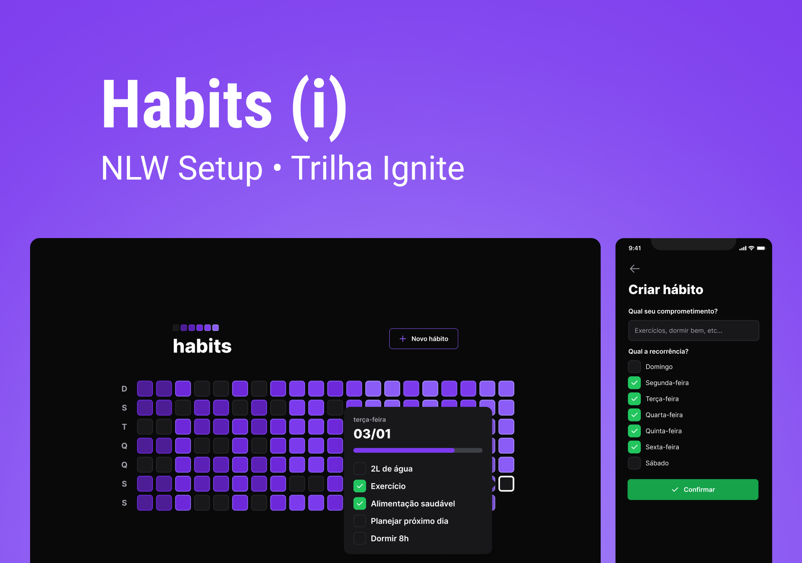

<div align="center" id="top">
  

  &#xa0;

  <!-- <a href="https://nlw-11-habits.netlify.app">Demo</a> -->
</div>

<h1 align="center">Habits</h1>

<p align="center">
  

  

  

  

</p>

<hr> -->

<p align="center">
  <a href="#about">About</a> &#xa0; | &#xa0;
  <a href="#sparkles-features">Features</a> &#xa0; | &#xa0;
  <a href="#rocket-technologies">Technologies</a> &#xa0; | &#xa0;
  <a href="#white_check_mark-requirements">Requirements</a> &#xa0; | &#xa0;
  <a href="#checkered_flag-starting">Starting</a> &#xa0; | &#xa0;
  <a href="#memo-license">License</a> &#xa0; | &#xa0;
  <a href="https://github.com/andrelinos" target="_blank">Author</a>
</p>

<br>

## About ##

Describe your project

## :sparkles: Features ##

- [x] Create habit
- [x] List habits
- [x] Check/UnCheck habits same done
- [x] Progressbar for habits
- [ ] Edit habit
- [ ] Delete habit
- [ ] Report habits
- [ ] List habits by category
- [ ] List habits by period
- [ ] Alert user about habit from day
- [ ] more...

## :rocket: Technologies ##

The following tools were used in this project:

The following tools were used in this project:

- [React](https://pt-br.reactjs.org/)
- [Next.js](https://nextjs.org/)
- [TypeScript](https://www.typescriptlang.org/)

## :white_check_mark: Requirements ##

Before starting :checkered_flag:, you need to have installed.

- [Git](https://git-scm.com)
- [Node](https://nodejs.org/en/)

## :checkered_flag: Starting ##

```bash
# Clone this project
$ git clone https://github.com/andrelinos/nlw-11-setup-habits-nextjs-13 habits

# Access
$ cd habits

# Install dependencies
$ npm i 

# Run the project
$ npm rum dev 

# execute migration dev prisma
$ npx prisma migrate dev

# Populate database
$ npx prisma db seed


# The server will initialize in the <http://localhost:3000/api>
# The web will initialize in the <http://localhost:3000>

```

## Screen app

<div align="center" id="web">
  

  &#xa0;

  <!-- <a href="https://nlw-11-habits.netlify.app">Demo</a> -->
</div>

## :memo: License ##

This project is under license from MIT. For more details, see the [LICENSE](LICENSE.md) file.

Made with :heart: by <a href="https://github.com/andrelinos" target="_blank">Andrelino Silva</a>

&#xa0;

<a href="#top">Back to top</a>
